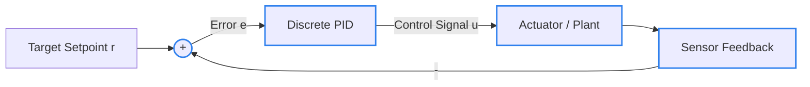

<h1 align="center">Closed-Loop PID Controller</h1>

<h3 align="center">STM32 • Feedback Systems • PID Control • Hardware Dynamics</h3>

  

  
  
  

---
NIGGA
### Overview

This project implements a real-time closed-loop control system on an STM32 microcontroller. The primary goal is exploring the practical bridge between digital algorithms and physical hardware behavior, analyzing how discrete controllers respond to continuous physical plants.

> *"The goal is not just to make the code work, but to understand what is actually happening between the controller, hardware, and physical system."*[cite: 1]

---

### Core Focus Areas

* **Feedback Systems**: Reading sensor feedback to close the execution loop in discrete time[cite: 1].
* **PID Control**: Calculating proportional, integral, and derivative terms to minimize tracking error[cite: 1].
* **Controller Tuning**: Adjusting gains to balance rise time, minimize overshoot, and eliminate steady-state error[cite: 1].
* **Sensor Feedback**: Acquiring and conditioning incoming measurement signals[cite: 1].
* **System Response**: Analyzing physical system dynamics across step inputs and continuous perturbations[cite: 1].
* **Real-World Hardware Behavior**: Mitigating non-ideal effects like actuator saturation, noise, and propagation delay[cite: 1].

---

### Control Topology

